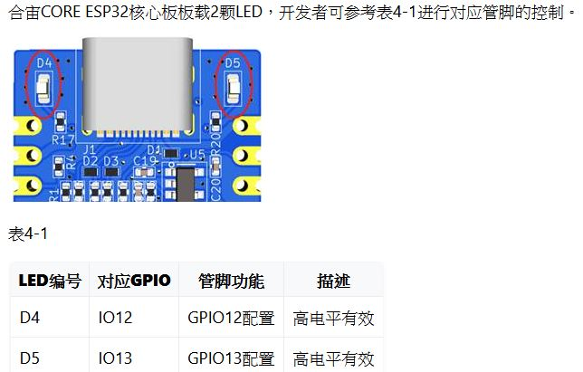

# EPS32_C3_C3-L_test
EPS32_C3_C3-L_合宙_test

  
  

where to buy, https://world.taobao.com/item/666579064570.htm  
合宙ESP32C3開發板 用於驗證ESP32C3芯片功能  

ESP32C3, USB-SERIAL GPIO18/19会被占用为USB脚, 应避免使用, 其他功能没有任何区别。  
CHIP CH343, driver www.wch.cn/downloads/CH343SER_EXE.html    
local copy, [CH343_driver](CH343_driver)  
run CH343SER_1.61_2022-05-13.EXE, install driver first,  

ESP32C3-L, no CH343  

  

ROM 1路SPI FLASH，板载4MB，支持最高 16MB  
FLASH CHIP MXIC MX25L3233F, 4MB, (32Mb)  
[MX25L3233F_4MB.pdf](MX25L3233F_4MB.pdf) data sheet  
IO14/15/16/17  
  

https://wiki.luatos.com/chips/esp32c3/board.html  

howto uses with Arduino IDE  
https://blog.csdn.net/a1415539404a/article/details/124534428  

LED  
D4, IO2  
D5, IO3  
  

Button  
RST  
BOOT / IO9  

Code  
[ESP32C3_BLINK.ino](ESP32C3_BLINK.ino)  

note
disable USB CDC mode for C3
FLASH mode DIO, a must

no CH343 chip, enable USB-CDC mode  
  
